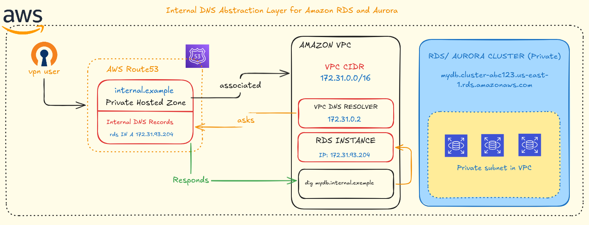

# Internal DNS Abstraction Layer for Amazon RDS and Aurora

<div align="center">
  


## Decouple Applications from AWS RDS Endpoints with Private DNS

**Updated: December 2, 2025**

[](https://github.com/nicoleepaixao)
[](https://github.com/nicoleepaixao/aws-internal-rds-dns-layer)

</div>

---

## **Overview**

This repository provides a complete reference implementation for designing and deploying an internal DNS layer that masks Amazon RDS and Aurora endpoints. The goal is to decouple applications from AWS-generated database hostnames by introducing a consistent private DNS naming standard using **Route 53 Private Hosted Zones**.

---

## **Important Information**

### **The Challenge**

| **Aspect** | **Details** |
|------------|-------------|
| **Problem** | Applications directly consume AWS-generated RDS/Aurora endpoints |
| **Risk** | Tight coupling makes migrations, upgrades, and failovers risky |
| **Complexity** | Difficult to govern across multiple environments |
| **Change Impact** | Blue/green deployments require application code changes |
| **Security** | Direct exposure of AWS-generated hostnames |

### **The Solution**

AWS generates unique RDS and Aurora endpoints that often change during upgrades, blue/green deployments, or cluster replacements. Applications that directly consume these endpoints become tightly coupled to infrastructure, increasing operational risk.

This project introduces an internal DNS abstraction using **Route 53 Private Hosted Zones**, allowing applications and engineers to connect to databases using stable, human-readable, environment-agnostic names.

**Example Internal DNS Names:**

```
orders-db-dev.internal.example
orders-aurora-prd.internal.example
orders-aurora-prd-ro.internal.example
```

These internal hostnames resolve only within VPCs and VPN connections, increasing both security and flexibility.

### **Project Benefits**

- **Decoupled Applications**: No code changes needed for database migrations
- **Consistent Naming**: Standardized DNS convention across all environments
- **Enhanced Security**: Internal resolution only (VPC + VPN)
- **Operational Flexibility**: Safe upgrades, failovers, and blue/green deployments
- **Multi-Account Support**: Scalable model for AWS Organizations

---

## **Architecture**

<p align="center">
  
</p>


**Resolution Flow:**

1. Application or VPN user queries `orders-db-prd.internal.example`
2. VPC DNS Resolver forwards to Route 53 Private Hosted Zone
3. Private Hosted Zone returns CNAME to real RDS endpoint
4. Connection established to actual database

---

## **Features**

| **Feature** | **Description** |
|-------------|-----------------|
| **Automated Discovery** | Python + Boto3 script for RDS/Aurora inventory |
| **Full Inventory** | Scans across multiple accounts and regions |
| **Naming Convention** | Standardized internal DNS template |
| **Architecture Diagram** | Visual reference for DNS abstraction layer |
| **Writer & Reader Support** | Handles both cluster endpoints |
| **Multi-Account Ready** | Ideal for AWS Organizations |
| **CSV Exports** | Inventory and DNS mapping examples included |

---

## **Internal DNS Naming Standard**

### **Convention**

```
<service>-<type>-<environment>.internal.<domain>
```

### **Examples**

| **Service** | **Type** | **Environment** | **Internal DNS** |
|-------------|----------|-----------------|------------------|
| billing | db | dev | `billing-db-dev.internal.example` |
| billing | aurora | prd | `billing-aurora-prd.internal.example` |
| billing | aurora | prd (reader) | `billing-aurora-prd-ro.internal.example` |
| orders | db | hom | `orders-db-hom.internal.example` |

---

## **How to Get Started**

### **1. Clone Repository**

```bash
git clone https://github.com/nicoleepaixao/aws-internal-rds-dns-layer.git
cd aws-internal-rds-dns-layer
```

### **2. Configure AWS Profiles**

Ensure your AWS profiles are configured in `~/.aws/config`:

```ini
[profile dev-account]
region = us-east-1
output = json

[profile staging-account]
region = us-east-1
output = json

[profile prod-account]
region = us-east-1
output = json
```

### **3. Install Dependencies**

```bash
pip install boto3
```

### **4. Run Inventory Script**

```bash
python scripts/rds_inventory.py
```

**Output:** CSV file with timestamp: `rds_inventory_20251202T123045Z.csv`

**Note:** The script scans all configured accounts and regions for RDS instances and Aurora clusters.

---

## **Running the Inventory Script**

### **Script Configuration**

Edit `scripts/rds_inventory.py` to customize:

```python
ACCOUNTS = [
    {"profile": "dev-account", "alias": "dev"},
    {"profile": "staging-account", "alias": "staging"},
    {"profile": "prod-account", "alias": "prod"},
]

REGIONS = ["us-east-1", "sa-east-1"]
```

### **Execution**

```bash
python scripts/rds_inventory.py
```

### **Output Contains**

- Account profile and ID
- Region
- Resource type (instance, cluster-writer, cluster-reader)
- Database identifier
- Engine and version
- Real AWS endpoint
- Port

---

## **Understanding the Output**

### **Inventory Sample (inventory_sample.csv)**

Raw data collected by the Python script:

| account_profile | account_alias | region | resource_type | identifier | engine | endpoint | port |
|-----------------|---------------|--------|---------------|------------|--------|----------|------|
| dev-account | dev | us-east-1 | instance | orders-db-dev | postgres | orders-db-dev.c1abcxyz123.us-east-1.rds.amazonaws.com | 5432 |
| prod-account | prod | us-east-1 | cluster-writer | orders-aurora-prd | aurora-postgresql | orders-aurora-prd.cluster-prd123abcd.us-east-1.rds.amazonaws.com | 5432 |
| prod-account | prod | us-east-1 | cluster-reader | orders-aurora-prd | aurora-postgresql | orders-aurora-prd.cluster-ro-prd123abcd.us-east-1.rds.amazonaws.com | 5432 |

### **DNS Mapping Example (dns_mapping_example.csv)**

Final mapping with internal DNS names applied:

| service | environment | type | real_endpoint | internal_dns |
|---------|-------------|------|---------------|--------------|
| orders | dev | db | orders-db-dev.c1abcxyz123.us-east-1.rds.amazonaws.com | orders-db-dev.internal.example |
| orders | prd | aurora-writer | orders-aurora-prd.cluster-prd123abcd.us-east-1.rds.amazonaws.com | orders-aurora-prd.internal.example |
| orders | prd | aurora-reader | orders-aurora-prd.cluster-ro-prd123abcd.us-east-1.rds.amazonaws.com | orders-aurora-prd-ro.internal.example |

---

## **Implementation Steps**

### **Phase 1: Discovery**

1. Run inventory script across all accounts
2. Generate CSV with all RDS/Aurora resources
3. Review and validate collected data

### **Phase 2: Design**

1. Define internal DNS naming convention
2. Create DNS mapping spreadsheet
3. Plan Private Hosted Zone structure

### **Phase 3: Deployment**

1. Create Route 53 Private Hosted Zone (`internal.example`)
2. Associate PHZ with VPCs
3. Create CNAME records mapping internal names to real endpoints
4. Test DNS resolution from VPC and VPN

### **Phase 4: Migration**

1. Update application configurations with internal DNS names
2. Test connectivity in non-production environments
3. Roll out to production applications
4. Decommission direct endpoint references

---

## **Why This Matters**

| **Benefit** | **Impact** |
|-------------|------------|
| **Application Decoupling** | Zero code changes for database migrations |
| **Simplified Operations** | Safe upgrades and blue/green deployments |
| **Enhanced Security** | No public exposure of AWS-generated endpoints |
| **Better Governance** | Consistent naming across all environments |
| **Smooth Failovers** | Transparent cluster replacements |
| **Cost Optimization** | Easier to test and migrate to newer instance types |

---

## **Use Cases**

This DNS abstraction layer is ideal for:

- **Database Migrations**: Replace RDS instances without touching application code
- **Blue/Green Deployments**: Switch between database clusters seamlessly
- **Multi-Environment Management**: Consistent naming across dev/staging/prod
- **Disaster Recovery**: Quick failover to backup regions
- **Version Upgrades**: Test new engine versions without application changes
- **Multi-Account Organizations**: Standardize DNS across AWS accounts

---

## **Technologies Used**

| **Technology** | **Version** | **Purpose** |
|----------------|-------------|-------------|
| Python | 3.8+ | Automation and inventory script |
| boto3 | Latest | AWS SDK for RDS/Aurora API calls |
| Route 53 | - | Private Hosted Zones and DNS management |
| AWS RDS | - | Relational database service |
| Amazon Aurora | - | Cloud-native relational database |

---

## **Project Structure**

```text
aws-internal-rds-dns-layer/
│
├── README.md                      # Complete project documentation
│
├── scripts/
│   └── rds_inventory.py           # Python inventory automation script
│
├── examples/
│   ├── inventory_sample.csv       # Raw RDS/Aurora inventory example
│   └── dns_mapping_example.csv    # Internal DNS mapping example
│
├── architecture/
│   └── dns-architecture-diagram.txt  # ASCII architecture diagram
│
└── .gitignore                     # Ignored files (*.csv, .env, etc.)
```

---

## **Additional Information**

For more details about AWS RDS, Aurora, and Route 53 Private DNS, refer to:

- [Amazon RDS Documentation](https://docs.aws.amazon.com/rds/) - Complete RDS reference
- [Amazon Aurora Documentation](https://docs.aws.amazon.com/AmazonRDS/latest/AuroraUserGuide/) - Aurora user guide
- [Route 53 Private Hosted Zones](https://docs.aws.amazon.com/Route53/latest/DeveloperGuide/hosted-zones-private.html) - DNS configuration
- [boto3 RDS Documentation](https://boto3.amazonaws.com/v1/documentation/api/latest/reference/services/rds.html) - Python SDK

---

## **Future Enhancements**

| **Feature** | **Description** | **Status** |
|-------------|-----------------|------------|
| Terraform Module | IaC for automated PHZ + CNAME creation | Planned |
| Multi-Region Support | Cross-region DNS resolution | In Development |
| DNS Health Checks | Monitor endpoint availability | Planned |
| Automated Migration | Script to update application configs | Future |
| Dashboard Integration | QuickSight visualization of DNS mapping | Future |
| Secrets Manager Integration | Automatic credential rotation | Planned |

---

## **Connect & Follow**

Stay updated with AWS infrastructure automation and best practices:

<div align="center">

[](https://github.com/nicoleepaixao)
[](https://www.linkedin.com/in/nicolepaixao/)
[](https://medium.com/@nicoleepaixao)

</div>

---

## **Disclaimer**

This implementation is provided as a reference architecture. AWS service configurations, pricing, and availability may vary by region. Always test DNS resolution thoroughly in non-production environments before deploying to production. Consult official AWS documentation for the most current information.

---

<div align="center">

**Happy building resilient AWS architectures!**

*Document last updated: December 7, 2025*

</div>
